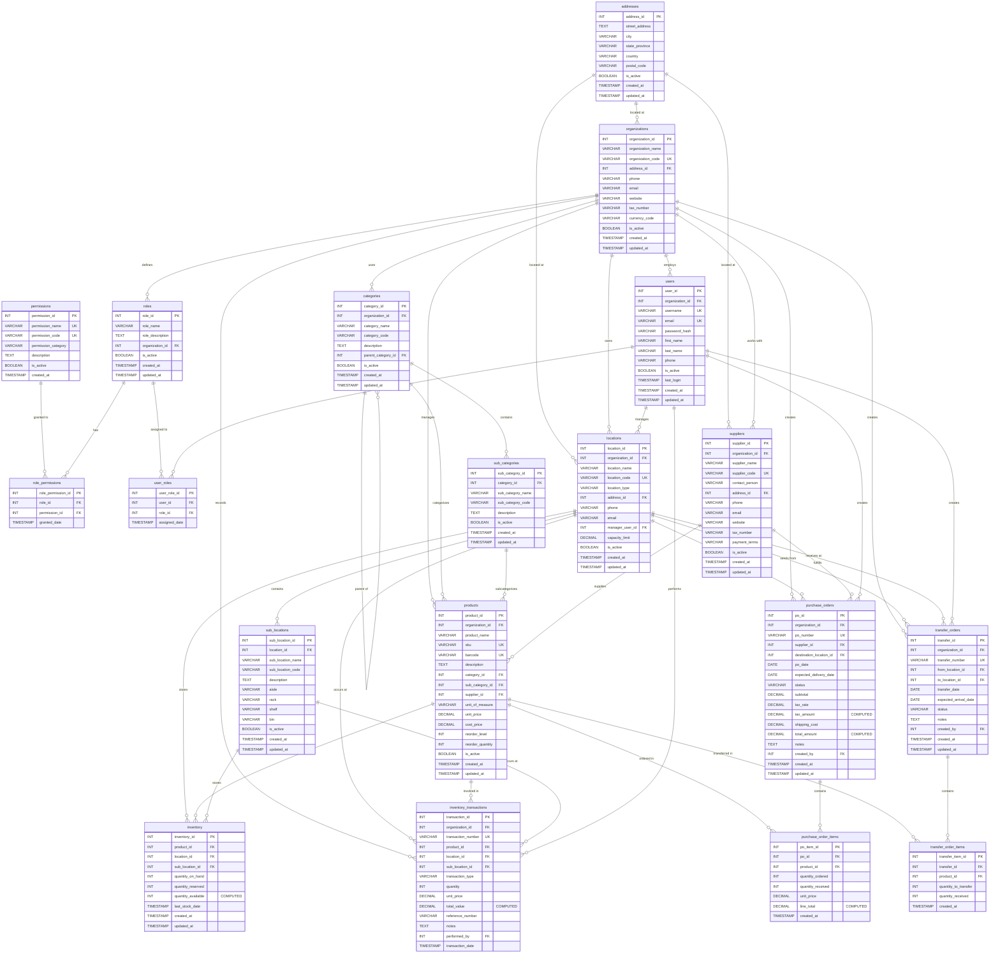

# Inventory Management System

A comprehensive web-based inventory management system built with HTML5, CSS3, Bootstrap 5, and JavaScript.

---
## Group 3 Members
- u22877194 - Van Wyk Grotius
- u22522281 - Marin Smit

---
## Features

### Core Modules
- **Product Management** - Complete CRUD operations for products
- **Inventory Tracking** - Real-time inventory overview and stock levels
- **Purchase Orders** - Create, approve, and manage purchase orders
- **Transfer Orders** - Transfer stock between locations
- **Location Management** - Manage warehouses and branches
- **Supplier Management** - Maintain supplier database
- **Category Management** - Organize products with categories and sub-categories
- **User & Role Management** - Control access with role-based permissions

---

## Project Structure

```
inventory-management-system/
│
├── index.html                          # Login page
├── dashboard.html                      # Main dashboard
├── README.md                          # Project documentation
│
├── css/
│   ├── style.css                      # Custom styles
│   └── responsive.css                 # Responsive breakpoints
│
├── js/
│   ├── main.js                        # Core JavaScript functions
│   └── charts.js                      # Chart configurations
│
├── assets/
│   ├── images/                        # Image assets
│   └── icons/                         # Icon files
│
├── pages/
│   ├── products/
│   │   ├── products-list.html         # Products listing
│   │   ├── add-product.html           # Add new product
│   │   └── edit-product.html          # Edit product
│   │
│   ├── inventory/
│   │   ├── inventory-overview.html    # Inventory dashboard
│   │   └── inventory-transactions.html # Transaction history
│   │
│   ├── purchase-orders/
│   │   ├── po-list.html               # PO listing
│   │   ├── create-po.html             # Create PO
│   │   └── po-details.html            # PO details
│   │
│   ├── transfer-orders/
│   │   ├── transfer-list.html         # Transfer listing
│   │   ├── create-transfer.html       # Create transfer
│   │   └── transfer-details.html      # Transfer details
│   │
│   ├── locations/
│   │   └── locations.html             # Location management
│   │
│   ├── suppliers/
│   │   └── suppliers.html             # Supplier management
│   │
│   ├── categories/
│   │   └── categories.html            # Category management
│   │
│   └── users/
│       └── users.html                 # User & role management
│
└── components/
    ├── sidebar.html                   # Sidebar component (reference)
    ├── navbar.html                    # Navbar component (reference)
    └── footer.html                    # Footer component (reference)
```

---

## Getting Started

### Prerequisites
- Modern web browser (Chrome, Firefox, Safari, Edge)
- Text editor or IDE (VS Code recommended)
- Live Server extension (for local development)

### Installation

1. **Clone the repository**
   ```bash
   git clone https://github.com/u22877194/BFB-321-Inventory-Management-Group3.git
   cd BFB-321-Inventory-Management-Group3
   ```

2. **Open in VS Code**
   
   **Using VS Code GUI:**
   - Open VS Code
   - Click `File → Open Folder`
   - Select the `inventory-management-system` folder
   - Click `Open`


3. **Install Live Server Extension**
   - Open VS Code Extensions (Ctrl+Shift+X)
   - Search for "Live Server"
   - Install by Ritwick Dey

4. **Run the Application**
   - Right-click `index.html`
   - Select "Open with Live Server"
   - Application opens at `http://localhost:5500`

### Demo Login Credentials
```
Email: admin@example.com
Password: admin123
```

---

## Technology Stack

| Technology | Purpose |
|------------|---------|
| **HTML5** | Structure and markup |
| **CSS3** | Styling and animations |
| **Bootstrap 5.3** | Responsive framework |
| **Bootstrap Icons** | Icon library |
| **JavaScript (ES6+)** | Interactivity and logic |
| **Chart.js** | Data visualization |


---


## Database Schema

The system uses a fully normalized (3NF) relational database with 19 core tables.

### Entity Relationship Diagram (ERD)


### Database Overview

### Core Tables

**Organization & Users**
1. **addresses** - Centralized address storage (eliminates redundancy)
2. **organizations** - Company information
3. **permissions** - System permissions
4. **roles** - User roles
5. **role_permissions** - Role-permission mapping (Many-to-Many)
6. **users** - User accounts
7. **user_roles** - User-role mapping (Many-to-Many)

**Locations & Products**
8. **locations** - Warehouses and stores
9. **sub_locations** - Location subdivisions (aisles, racks, shelves)
10. **categories** - Product categories (hierarchical)
11. **sub_categories** - Product subcategories
12. **suppliers** - Vendor information
13. **products** - Product master data

**Inventory & Transactions**
14. **inventory** - Current stock levels by location
15. **inventory_transactions** - Stock movement history
16. **purchase_orders** - Purchase order headers
17. **purchase_order_items** - PO line items
18. **transfer_orders** - Stock transfers between locations
19. **transfer_order_items** - Transfer line items

### Key Relationships

- **One-to-Many**: 
  - organizations → users, locations, products
  - locations → sub_locations, inventory
  - products → inventory, order items
  
- **Many-to-Many**: 
  - users ↔ roles (via user_roles)
  - roles ↔ permissions (via role_permissions)
  
- **Self-Referencing**: 
  - categories → parent_category (hierarchical structure)

---

---

## Known Issues & Limitations

### Current Limitations
- **No Backend**: Frontend only - requires API integration
- **Demo Data**: Uses sample/mock data
- **No Authentication**: Login is simulated
- **No Database**: No persistent data storage
- **localStorage Only**: Data stored in browser (not permanent)

### Browser Compatibility
- Chrome 90+
- Firefox 88+
- Safari 14+
- Edge 90+
- Internet Explorer (not supported)


**Note**: This is a frontend-only application. For production use, you would need to add backend functionality for database connectivity, authentication, and API integration.